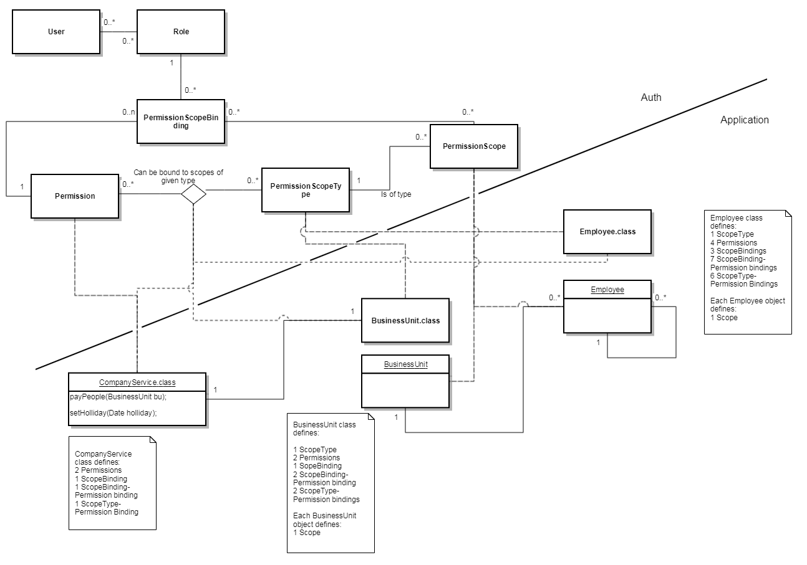

= Overview

Antora UI Spring theme.

This is a sample text compared to headers

== H2
=== H3
==== H4
===== H5
====== H6

Image sample:

.Sample auth application

Image inside table sample:

[cols="",options="header",]
|===
|
|Sample auth application
|===

.import scopes example

[source]

----

java -jar authcli-3.6.0.jar

Welcome to PsiAuth command line interface

before doing anything you need to connect

to do so, use the connect command

 

prompt> connect http://127.0.0.1:8080/authservice admin -p

Enter value for -password ():

...

Connected successfully to: http://127.0.0.1:8080/authservice-3.4.0 as: admin

 

prompt> import-scopes C:/example/permission.xml MyProject

ActionDescInfo(objectId=PAI-ID, objectName=PAI_NAME, objectType=PermissionScope, action=Created)

 

prompt> exit

----

[[src-2093091452_safe-id-aWQtKElucHJvZ3Jlc3MpKGF1dGhQSkYzLjcpQXV0aENMSShDb21tYW5kTGluZUludGVyZmFjZSktVXNlaW5Ob24tSW50ZXJhY3RpdmVNb2RlOkltcG9ydFBlcm1pc3Npb25zZnJvbUZpbGU]]

[cols=",,",options="header",]
|===
|*Property*  |*Description*
|*Default*
|_autoregistration_ |Enables/disables event type auto-registration.
|_true_

|_workflow-enabled_ |Enables/disables complete server-side workflow
(expiration/evaluation/publishing). |_true_

|_evaluation-enabled_ |Enables/disables evaluation. |_true_

|_expiration-enabled_ |Enables/disables expiration. |_true_

|_publishing-enabled_ |Enables/disables publishing of statistic updates
to clients. |_true_

|_evaluation-period_ |Evaluation period in ms (!). |_10000_

|_evaluation-lookahead-threshold_ |Optimization; threshold, referring to
number-from of evaluation rules, for which a counting look-ahead should
be performed. |_20_

|_import-file_ |Name of XML-file containing event types; these event
types are imported during startup of the component (optional). |--

|_import-folder_ |Path to import-file; required only if import file is
not included to deployment, but should be read from file system instead
(optional). |--

|_confirmation.propagation.alerttoevent_ |Enables/disables confirmation
propagation from alert to events. |_true_

|_confirmation.propagation.eventtoalert_ |Enables/disables confirmation
propagation from events to alert(s). |_true_

|_confirmation.propagation.name_ |Name set by confirmation propagator
during confirmation of related events and alerts |_Confirmation
propagator_

|_evaluation-evaluator-jndi_ |JNDI name of evaluator implementation if
default implementation should be replaced (optional). |--

|_evaluation-expirer-jndi_ |JNDI name of expirer implementation if
default implementation should be replaced (optional). |--

|_evaluation-publisher-jndi_ |JNDI name of publisher implementation if
default implementation should be replaced (optional). |--

|_broadcasting-services-jndi_ |JNDI names of broadcasting
implementations if default implementation should be replaced (optional).
|--
|===
